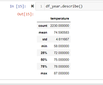
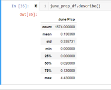
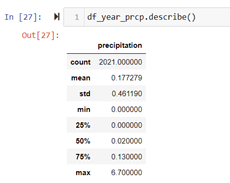

# Surfs_up Analysis

# OVERVIEW
## Purpose
To make the analysis of the weather of the Oahu Island in order to get the correct information to present the investors a good analysis to make a good decision making. 

# Results

In June the mean of the temperature is 74.94 grades,  with a standard deviation of 3.25. A minimum temperature of 64 and a maximum of 85. For December, the mean is 71.04 grades, with a standard deviation of 3.74, a minimum temperature of 56 and a maximum of 83.
With the above information we can see the following:
-	The mean temperature of June is greater than the mean temperature of December
-	Both metrics ha a small standard deviation
-	The maximum temperature of June is greater than the maximum temperature of December
I we make a new query to get the temperature of all the previous year we obtain next results:

As we can see, the average temperature of the complete year is 74.59 , which is very close to the temperature observed just for June.
For the June precipitation, we can see that the mean precipitation is 0.1363, with a maximum level of 4.43 as follows:

Finally, the information of the previous year is presented next:

As we can see from the image above, the average precipitation for the previous year was 0.1772, which is a bigger level presented only for the month of June, and the maximum average  precipitation is 6.70.

# Summary

From all the previous data, we can conclude that making an investment in an icecream and surf shop can be possible in the Oahu island, because  through the year it has a good average temperature of 74.59, not so far from the average levels of June, which is 74.94 , even in December with a temperature of 71.04, which is only 3 degrees less.

